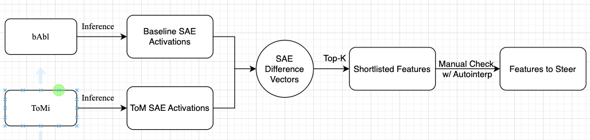

# tom-steer

## Current TODOs (DDL: April 17, Thursday, 23:59:59)

### For MTY and YTS
HYC wrote code to run on ToMChallenges and ARC-Easy, but the results were not good. Now we are changing the ToM dataset to ToMi (MTY) and the non-ToM dataset to bAbl (YTS).

1. Read `feature-mining/feature-mining.py` and understand the workflow. Basically the steps are: (a) Load the dataset, the model, and all the SAEs; (b) run through all entries in the dataset, for each of which, run model inference and hook all SAEs; (c) average SAE vectors out of all prompts and all token positions, then save data
2. Check ToMi / bAbl data structure and how to load it. (Check with HYC before proceeding, get concensus about how to form the prompts)
3. Create  `feature-mining/ToMi-mining.py` and `feature-mining/bAbl-mining.py` that loads corresponding dataset and perform the same tasks.
4. Primary goal: get average SAE activations for all layers;
5. Secondary goal: get performance on these dataset

**Note**: If `gemma-2-2b` caused not enough CUDA memory, tell HYC and just proceed with the other two models.

### For HYC
1. Write code for steering and benchmarking (ToMBench, Kosinski, ToMi, etc)
2. Visualization code for steering and benchmark charts
3. Time permitting, rerun baselines

## Next Steps
1. Final analyses (Friday & Saturday)
2. Poster (Sunday)